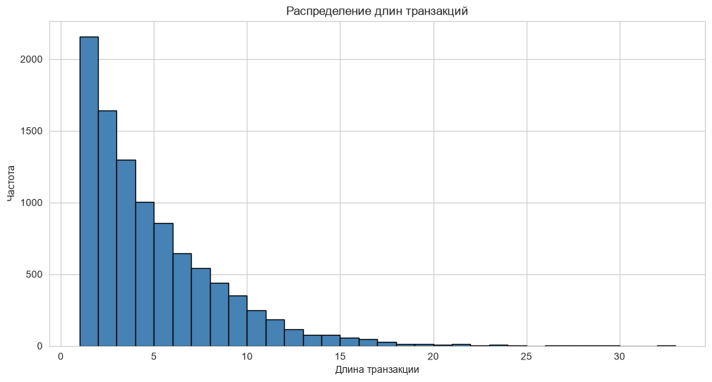
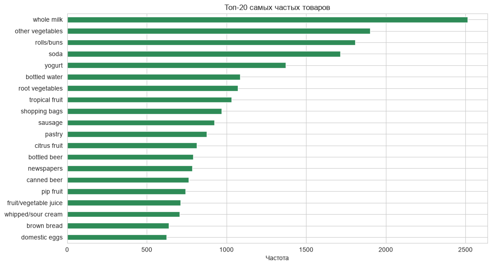
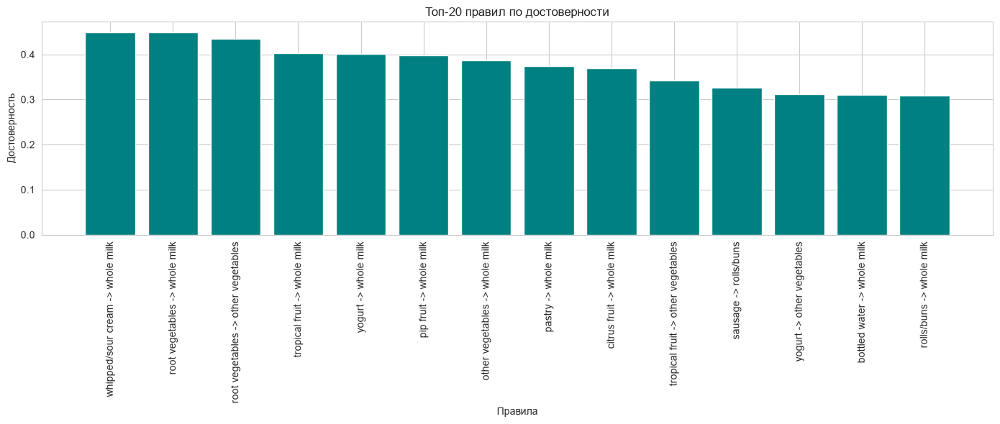
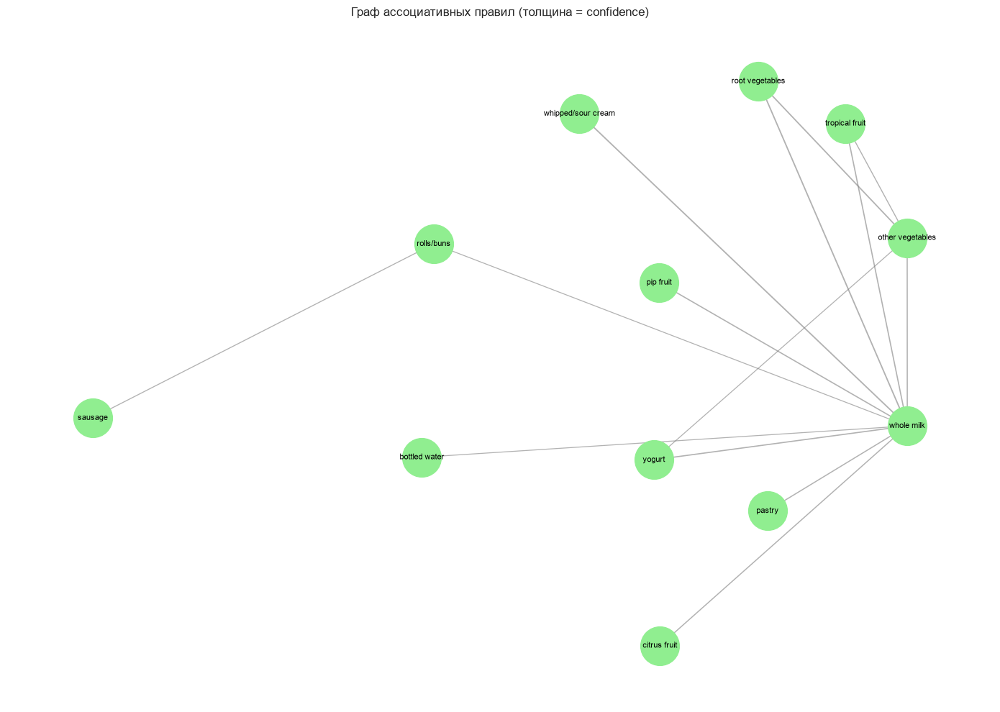
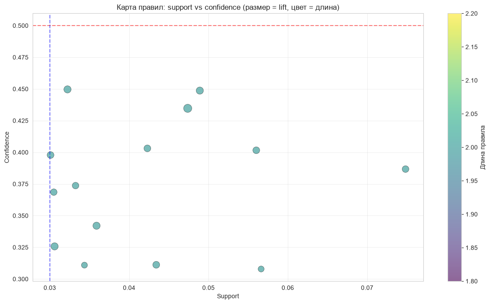

# Лабораторная работа №2. Ассоциативные правила

**Студент:** Зоркольцев Илья Алексеевич  
**Группа:** АВТ-313  

---

## 📌 Тема работы

Исследование методов анализа ассоциативных правил на датасете
**Groceries Market Basket Dataset**.

Цель работы — изучить алгоритмы поиска частых наборов (Apriori, FP-Growth),
построить ассоциативные правила, оценить их метрики (support, confidence,
lift) и предложить собственную визуализацию.

---

## 📊 Используемый датасет

**Groceries Market Basket Dataset** — данные о покупках в супермаркете.

- Количество транзакций: **9835**
- Количество уникальных товаров: **169**
- Формат: CSV, каждая строка — одна транзакция, товары через запятую
- Источник: [kaggle.com/datasets/irfanasrullah/groceries](https://www.kaggle.com/datasets/irfanasrullah/groceries)

---

## 🛠️ Что сделано в работе

1. **Загрузка датасета** `groceries.csv`.
2. **EDA:**
   - гистограмма распределения длин транзакций,
   - список уникальных товаров,
   - топ-20 самых частых товаров.
3. **Предобработка:** очистка транзакций, one-hot encoding.
4. **Apriori** (min_support = 0.03, min_confidence = 0.3):
   - поиск частых наборов,
   - генерация ассоциативных правил,
   - анализ полезных (lift > 1.3, confidence > 0.5) и тривиальных
     (lift ≈ 1) правил.
5. **FP-Growth** с теми же параметрами, сравнение с Apriori.
6. **Алгоритмический подбор min_support** для наборов длины 1, 2, 3, 4.
7. **Эксперименты с параметрами** — как support и confidence влияют
   на количество правил.
8. **Визуализация:**
   - граф ассоциативных правил (узлы — товары, рёбра — правила),
   - собственная визуализация: scatter-plot support vs confidence,
     где размер точки = lift, цвет = длина правила.

---

## 📈 Результаты

**При support = 0.03, confidence = 0.3:**

| Алгоритм | Частых наборов | Правил |
|----------|---------------|--------|
| Apriori | — | — |
| FP-Growth | — | — |








**Примеры найденных правил:**

| Правило | Support | Confidence | Lift |
|---------|---------|------------|------|
| — | — | — | — |

---

## 💡 Основные выводы

1. Датасет содержит 9835 транзакций и 169 уникальных товаров;
   средняя длина транзакции — около 4 товаров.
2. Apriori и FP-Growth дают **идентичные результаты** по составу
   частых наборов и правил; FP-Growth работает быстрее на больших данных.
3. При росте `min_support` и `min_confidence` количество правил
   резко падает. Оптимум для Groceries: support 0.02–0.03,
   confidence 0.3–0.5.
4. Алгоритмический подбор support: для наборов длины 1 достаточно
   ≈ 0.01, для длины 2 — ≈ 0.02, для длины 3 — ≈ 0.03, для длины 4 — ≈ 0.05.
5. Граф правил показывает «якорные» товары (whole milk, other
   vegetables и др.) и кластеры связанных товаров.
6. Правила с высоким lift полезны для бизнеса — их можно использовать
   для кросс-продаж и размещения товаров рядом на полке.

---

## 🧰 Стек технологий

- Python 3.10+
- pandas, numpy
- mlxtend (Apriori, FP-Growth, association_rules)
- networkx (граф правил)
- matplotlib, seaborn

---

## 🚀 Как запустить

###  VS Code 

1. Открыть папку проекта в VS Code.
2. Установить библиотеки:
   ```bash
   pip install pandas numpy seaborn matplotlib mlxtend networkx ipykernel